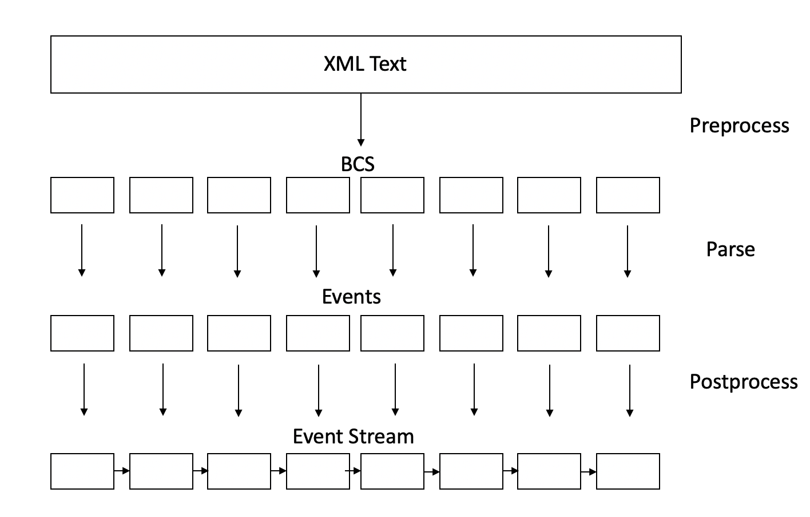

# PSAX

利用posix pthread库的事件驱动式的并行XML解析器😏

## SAX(Simple API for XML)主要特性

* event-based API for reading XML documents  (提供解析XML所产生的事件API)

* reads an XML document only once(只解析XML一次)

* each time the parser sees a start-tag, an end-tag, character data, or a processing instruction, it tells your program (每当解析器看到开始标签, 结束标签,字符数据,处理指令,解析器会通过回调函数通知你的程序)


## PSAX特点

* 快👻


## API

```c
#ifndef __PSAX_H__
#define __PSAX_H__
#include <stdlib.h>
typedef enum event_type{
    EVENT_DOCUMENT_BEGIN  = 0,
    EVENT_DOCUMENT_END    = 1,
    EVENT_ELEMENT_BEGIN   = 2,
    EVENT_EMPTY_ELEMENT   = 3,
    EVENT_ELEMENT_END     = 4,
    EVENT_ATTRIBUTE       = 5,
    EVENT_CHAR_DATA       = 6,
    EVENT_COMMENT         = 7,
    EVENT_PI              = 8,
    EVENT_CDATA           = 9,
} event_type_t;

typedef enum error_type{
    THREAD_NUM_ERROR    = 0,
    FILE_OPEN_ERROR     = 1,
    LEXICAL_ERROR       = 2,
    SYNTAX_ERROR        = 3,
} error_type_t;

#define MSG_BUF_SIZE 1024

typedef struct error{
    error_type_t 	type;
    int64_t 		row;
    int64_t 		col;
    char 			msg[MSG_BUF_SIZE];
} error_t;

typedef struct event{
    event_type_t 	type;
    int64_t 		offset;
    const char* 	name;
    int 			name_len;
    const char* 	value;
    int 			value_len;
} event_t;

typedef void* (*event_handler_t)(const event_t* event);

typedef void* (*error_handler_t)(const error_t* error);

int psax_parse(int thread_num, event_handler_t event_handler, error_handler_t error_handler, const char* filename);

#endif //__PSAX_H__
```


## 实现原理

1. 预处理阶段: 并行查找bcs, 形成链表; 之后串行检查错误元素, 再拆分全局链表, 形成局部链表;
2. 解析阶段: 每个线程处理一个局部链表. 根据bcs的类别, 并行解析XML, 形成局部事件流子串. 解析时, 采用递归下降的语法分析方法, 判别XML的元素类型, 从而形成事件流;
3. 后处理阶段: 合并局部事件流形成全局事件流, 并串行检查匹配问题.





## 运行结果分析

测试环境: MacOS 10.14 四核8线程 Intel Core i5-8259U 2.3GHz

测试方法: clock_gettime();

测试文件: test1.xml

| 线程数       | 测试1     | 测试2     |
| ------------ | --------- | --------- |
| 1            | 0.908347s | 0.724595s |
| 2            | 0.430399s | 0.417004s |
| 4            | 0.250553s | 0.252662s |
| 8            | 0.203334s | 0.195227s |
| 参考串行程序 | 0.614215s | 0.811599s |

可见基本符合古斯塔夫森定律, 说明程序有较好的伸缩性.

解析事件流输出已经重定向到test.out文件中.


## 参考文献

[1]方跃坚,余枝强,翟磊,吴中海.一种混合并行XML解析方法[J].软件学报,2013,24(06):1196-1206.

